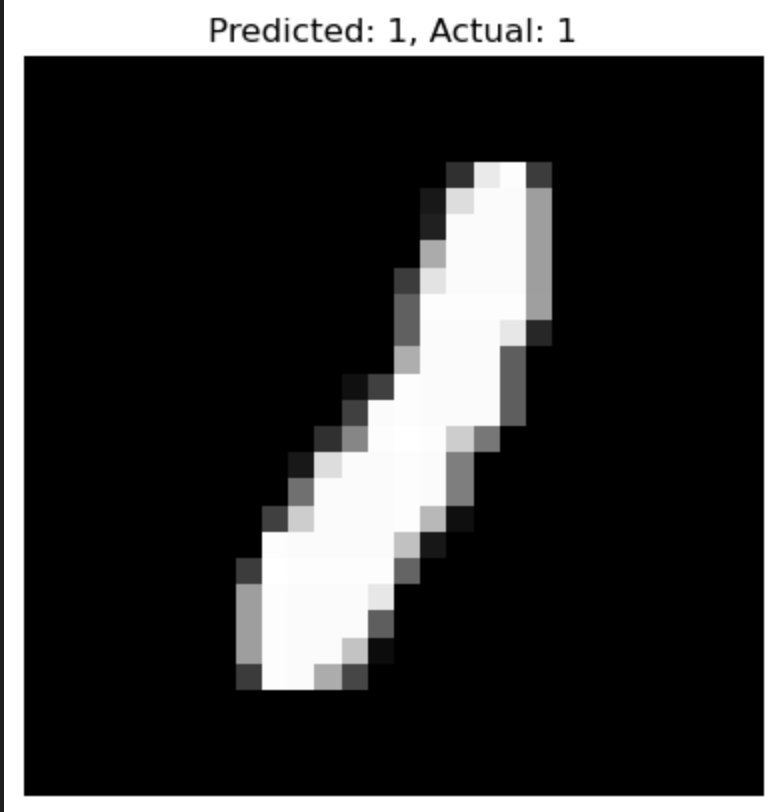
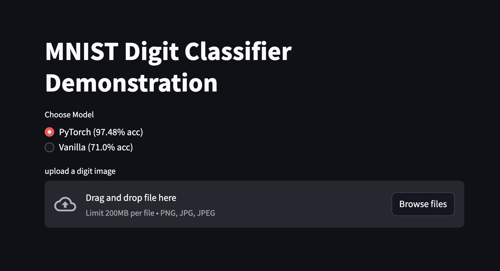
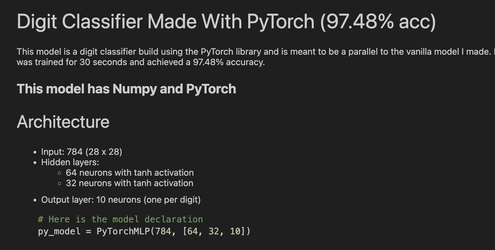

# About This Repository


**This was made to further build an intuition of what neural networks are.**

## This repo contains 2 models trained on the a MNIST dataset

### 1. Vanilla Model(**71% acc**)
    - This model used Python Classes inspired by [Karpathy’s Micrograd](https://github.com/karpathy/micrograd)
    - Does not use PyTorch, TensorFlow, or numpy. Every part of building the model was manually coded from the forward pass to activations to parameter updates.
    - Trained off a small subset of MNIST dataset(1000 images). Without numpy vectorization and optimized nature of libraries like PyTorch, model took extremely long to train.

### 2. PyTorch Model(**97.48% acc**)
    - This model implements the same architecture but using Pytorch's nn.Module for efficiency
    - Trained on the full dataset (56000 images). With the faster computations training was way quicker
    - Used to compare with MLP from scratch

# Digit Classification Streamlit App



**This is a web app that allows you to test the models for yourself. You can upload an image of a digit, and the app will predict it using either model.**

## Set up and Run Locally

### Prerequisites
- Python 3.8 or higher

### 1. Clone the Repository

Ensure that git is installed
```bash
git clone https://github.com/dshi08/Digit-Classification.git
cd digit-classification
```

### 2. Install Requirements

Ensure that you can see 2 model files in the models directory
```bash
pip install -r requirements.txt
```

### 3. Run the App!
```bash
streamlit run streamlit_app.py
```

### 4. Test models
To test, download any `.png, .jpg, .jpeg` image from a MNIST dataset

# To access Jupyter Notebook



### Prerequisites
- Python 3.8 or higher

### 1. Clone the Repository

Ensure that git is installed
```bash
git clone https://github.com/yourusername/digit-classification.git
cd digit-classification
```

### 2. Install Requirements

Ensure that you can see 2 model files in the models directory
```bash
pip install -r requirements.txt
```

### 3. Launch Jupyter Notebook

```bash
jupyter notebook
```

Then open digits.ipynb


